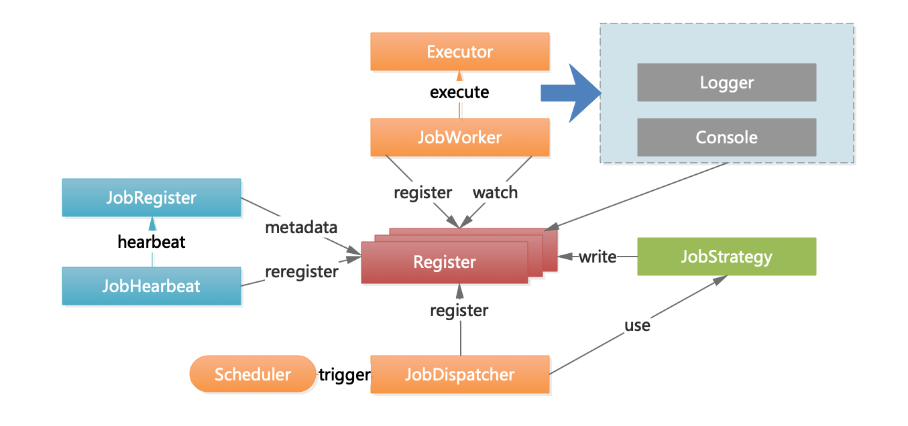

# 框架介绍
## 功能
* 与springboot天然集成。
* 支持任务的分片处理，比如：对于数据库中有100条数据，支持按照机器平均切分，也可以按照round robin的方式来轮训分片。
* 本框架不涉及具体的业务处理，如业务的幂等性处理。
* 对于任务的失败重试等策略，目前不支持，后续可以增加。
* 对于节点的权重，支持后续的扩展。

## 版本
第一版本Angle.M1。里程碑版本。
第二版本Angle.M2。20191007


## 架构图



## 使用说明
* 对于pom文件，需要具备以下
```$xslt
	<dependency>
		  <groupId>com.brave</groupId>
		  <artifactId>brave-disjob-spring-boot-starter</artifactId>
		  <version>Angel.M1</version>
	  </dependency>
```
* 对于每个任务，分为主调度任务，和执行任务，目前并未合并，所以实现一个任务，需要写两个类，并在properties文件中增加配置。
    * application.properties 
```$xslt
brave:
  jobs:
    - job: demo1
    - job: demo2
  register:
    center: localhost:2181
switcher: on
demo1:
  switcher: on
  cron: 0/30 * * * * ?

demo2:
  switcher: on
  cron: 0/40 * * * * ?
```
这里的Switcher:on可以省略，本来是用来设置全局开关的。

**增加主调度类**
```$xslt
@Slf4j
@Component
public class MainWorker extends WorkerRegister {

    @JobName(name = "demo1")
    public String jobName;

    @Override
    public void run(@NotNull String ids) {
        try {
            TimeUnit.SECONDS.sleep(40);
        } catch (InterruptedException e) {
            e.printStackTrace();
        }
        //处理列表，取得最大和最小的id，处理的时候，后台需要最好幂等的控制，否则不能用这种分片算法
        List<Integer> idl = processItem(ids);

        int minId = idl.stream().min(Integer::compareTo).orElse(0);
        int maxId = idl.stream().max(Integer::compareTo).orElse(0);
        log.info("{} the min:{},and the max is:{}",jobName,minId,maxId);
    }


    /**
     * 把worker现成注册上去。
     */
    @PostConstruct
    public void init() {
        super.init_1(jobName);
    }

}
```
这里的run方法，参数是ids是分片后每个节点的分片范围，所以，你需要处理的任务和逻辑就在这个方法里写即可。

需要在该方法里增加init方法，直接copy即可。

**增加处理线程类**
```$xslt
@Slf4j
@Component
public class MainDispatcher extends Dispatcher {

    @Value("${demo1.switcher}")
    public String switcher;

    @JobName(name = "demo1")
    public String jobName;


    @Scheduled(cron = "${demo1.cron}")
    public void process() {
        if(switcher == null || "off".equals(switcher)){
            log.info("分布式任务调度关闭。");
            return;
        }
        run(jobName);

    }

    /**
     * 代扣任务获取和分片
     */
    @Override
    public void dispatchWork() {
        //获取id列表
        List<Integer> ids = Arrays.asList(1,2,3,4,5,6);
        writeWorkerData(jobName,ids);
    }
}

```
这里需要注意的是
    
    * switcher是任务的开关，在配置文件中配置。
    * jobName用自定义注解的方式，和配置文件中任务名称一致。
    * 本类主要有两个方法：第一个是定义启动方法，第二个是分配的方法，

写完以上两个类，基本就可以运行了，当然，需要有Zookeeper集群。所有的信息还是注册在Zookeeper集群上的。

## Angel.M2版本
* 优化了注册worker节点信息，如果存在就不注册。
* 优化了worker对象，目前如下即可
```java
@Slf4j
@Component
@EnableBraveDisJob(name = "demo3")
public class MainWorker extends WorkerRegister {

    public String jobName;

    @Override
    public void run(@NotNull String ids) {
        try {
            TimeUnit.SECONDS.sleep(40);
        } catch (InterruptedException e) {
            e.printStackTrace();
        }
        //处理列表，取得最大和最小的id，处理的时候，后台需要最好幂等的控制，否则不能用这种分片算法
        List<Integer> idl = processItem(ids);

        int minId = idl.stream().min(Integer::compareTo).orElse(0);
        int maxId = idl.stream().max(Integer::compareTo).orElse(0);
        log.info("{} the min:{},and the max is:{}",jobName,minId,maxId);
    }

}
```
目前只需要自己实现一个run方法即可。如果需要打印或者记录job的相关的信息，可以加一个属性jobName，jobName会被自动注入job的配置名字。


## 20191012优化点
* 新增job switcher属性，并注册到zookeeper。
* 在yml文件中配置如下：
```yml
brave:
  jobs:
    - job: demo3
      switcher: on
```
## 下一版本可能迭代
* 优化autoconfigure逻辑，包括：
	- 注册逻辑优化，代码精简。
	- 合并worker和dispatcher.
	- 添加持久层的starter支持。
